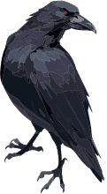

# Quoth

_Then this ebony bird beguiling my sad fancy into smiling,_  
_By the grave and stern decorum of the countenance it wore,_  
_“Though thy crest be shorn and shaven, thou,” I said, “art sure no craven,_  
_Ghastly grim and ancient Raven wandering from the Nightly shore—_  
_Tell me what thy lordly name is on the Night’s Plutonian shore!”_  
_**Quoth** the Raven “Nevermore.”_  

— Edgar Allan Poe's _The Raven_
  

**Quoth** is a _scannerless_ parsing library (meaning there is no lexing/tokenization step)
specifically designed for implementing languages and DSLs (domain specific languages) in Rust.
It is based on the admittedly [dtolnayian](https://crates.io/users/dtolnay) idea from
[syn](https://crates.io/crates/syn) that everything should implement the same `Parse` trait,
however quoth takes this idea further to the point where lexing is no longer necessary, and
what you are left with is something akin to "Object Oriented Parsing" where it is quite easy to
compose, combine, parse, and even "unparse" `Parsable`s in a myriad of ways.

In quoth, everything implements `Parsable`, which brings with it a large set of requirements
(and thus features) that are at best conventions in other parsing ecosystems. Some core
features of quoth include:
- anything that can be parsed with quoth can also be "unparsed" i.e. converted back to a string
- because there is no tokenization step, the unmodified `Span` source text for any `Parsable`
  is _always_ available and is cheap/free to access at any time during parsing
- `Span` itself is very lightweight and is just a reference-counted string slice into a
  `Source`
- because of this, `ParseStream` is also incredibly lightweight and provides normally expensive
  operations like forking virtually for free
- in quoth, you can peek by `Parsable` type, but you can also peek _by value_, and even _by
  regex_
- branching is much easier to represent
